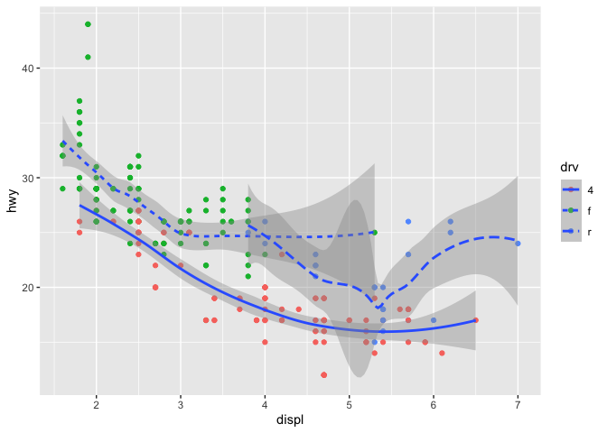

# Lecture Overview
Goals of the lesson:

* Students will be able to read in a csv file
* Students will be able to manipulate data using dplyr functions
* Create data visualizations with ggplot

Instructor Notes:

* Have them read in the csv (it is just the starwars dataset from the tidyverse package, but they need to know how to do read_csv() for the homework assignment).
* Students are often confused about file paths and where their Downloads folder is. Some may ask for assistance with this.


# Using Packages
R is really useful because of its ability to use packages. Pacman is a package for "package management" - it helps us load multiple packages at once.


```r
#install.packages("pacman")
```
We need to load the a package after installing it to use it by using `library()`.

```r
library(pacman)
```

Now we use the p_load function to load other packages we want to use. Today, we will use the `tidyverse()` package.

```r
p_load(tidyverse)
```

# Tidyverse
Tidyverse is used for data wrangling. It allows you to manipulate data frames in a rather intuitive way. Tidyverse is a huge package so today we will be focusing on functions from the dplyr package (comes with tidyverse).

* select(): subset columns
* filter(): subset rows on conditions
* arrange(): sort results
* mutate(): create new columns by using information from other columns
* group_by() and summarize(): create summary statistics on grouped data
* count(): count discrete values

## Directories
We need to get some data before we can start working with it! Download the "Lab2.csv" file from Canvas. It should then be in your Downloads folder. 

Now, we need to make sure that we are working in the same place as our data is, so that R knows where to get the csv file from. The function `getwd()` will give you the file path of your current location.

```r
getwd()
```

```
## [1] "/Users/boyoonc/ec320_labs/lab2"
```

Now, if this is not the same location as your Downloads folder, you need to tell R to set a new working directory. You can use `setwd()` to tell R where to go. 

For example, if I want to go to my Downloads folder on my mac, I can write:

```r
#setwd("/Users/jenniputz/Downloads") # commented out so it doesn't run this line!

# Note, if you are on windows, your file path would start with a C:\ and use \'s
```

Now R will be working in my Downloads folder. We can read in our data using `read_csv()`. Remember that everything in R is an object, so you *must* give your data frame a name.


```r
our_data <- read_csv("lab2.csv") # this should read after changing to the appropriate wd using setwd() above
```

```
## 
## ── Column specification ────────────────────────────────────────────────────────
## cols(
##   name = col_character(),
##   height = col_double(),
##   mass = col_double(),
##   hair_color = col_character(),
##   skin_color = col_character(),
##   eye_color = col_character(),
##   birth_year = col_double(),
##   sex = col_character(),
##   gender = col_character(),
##   homeworld = col_character(),
##   species = col_character()
## )
```

## Dplyr Functions
We can view our data frame by typing view(data) or by clicking the name in the global environment

```r
view(our_data)
# Can also look at names of variables
names(our_data)
```

```
##  [1] "name"       "height"     "mass"       "hair_color" "skin_color"
##  [6] "eye_color"  "birth_year" "sex"        "gender"     "homeworld" 
## [11] "species"
```

### Select and Filter
Let's select only the name, gender, and homeworld variables

```r
select(our_data, c(name, gender, homeworld))
```

```
## # A tibble: 87 × 3
##    name               gender    homeworld
##    <chr>              <chr>     <chr>    
##  1 Luke Skywalker     masculine Tatooine 
##  2 C-3PO              masculine Tatooine 
##  3 R2-D2              masculine Naboo    
##  4 Darth Vader        masculine Tatooine 
##  5 Leia Organa        feminine  Alderaan 
##  6 Owen Lars          masculine Tatooine 
##  7 Beru Whitesun lars feminine  Tatooine 
##  8 R5-D4              masculine Tatooine 
##  9 Biggs Darklighter  masculine Tatooine 
## 10 Obi-Wan Kenobi     masculine Stewjon  
## # … with 77 more rows
```
Notice that this didn't save anything in our global environment! If you want to save this new dataframe, you have to give it a name!

To select all columns except a certain one, use a minus sign

```r
select(our_data, c(-homeworld, -gender))
```

```
## # A tibble: 87 × 9
##    name    height  mass hair_color skin_color eye_color birth_year sex   species
##    <chr>    <dbl> <dbl> <chr>      <chr>      <chr>          <dbl> <chr> <chr>  
##  1 Luke S…    172    77 blond      fair       blue            19   male  Human  
##  2 C-3PO      167    75 <NA>       gold       yellow         112   none  Droid  
##  3 R2-D2       96    32 <NA>       white, bl… red             33   none  Droid  
##  4 Darth …    202   136 none       white      yellow          41.9 male  Human  
##  5 Leia O…    150    49 brown      light      brown           19   fema… Human  
##  6 Owen L…    178   120 brown, gr… light      blue            52   male  Human  
##  7 Beru W…    165    75 brown      light      blue            47   fema… Human  
##  8 R5-D4       97    32 <NA>       white, red red             NA   none  Droid  
##  9 Biggs …    183    84 black      light      brown           24   male  Human  
## 10 Obi-Wa…    182    77 auburn, w… fair       blue-gray       57   male  Human  
## # … with 77 more rows
```

Filter the data frame to include only droids

```r
filter(our_data, species == "Droid")
```

```
## # A tibble: 6 × 11
##   name   height  mass hair_color skin_color  eye_color birth_year sex   gender  
##   <chr>   <dbl> <dbl> <chr>      <chr>       <chr>          <dbl> <chr> <chr>   
## 1 C-3PO     167    75 <NA>       gold        yellow           112 none  masculi…
## 2 R2-D2      96    32 <NA>       white, blue red               33 none  masculi…
## 3 R5-D4      97    32 <NA>       white, red  red               NA none  masculi…
## 4 IG-88     200   140 none       metal       red               15 none  masculi…
## 5 R4-P17     96    NA none       silver, red red, blue         NA none  feminine
## 6 BB8        NA    NA none       none        black             NA none  masculi…
## # … with 2 more variables: homeworld <chr>, species <chr>
```

Filter the data frame to include droids OR humans

```r
filter(our_data, species == "Droid" | species == "Human")
```

```
## # A tibble: 41 × 11
##    name    height  mass hair_color  skin_color eye_color birth_year sex   gender
##    <chr>    <dbl> <dbl> <chr>       <chr>      <chr>          <dbl> <chr> <chr> 
##  1 Luke S…    172    77 blond       fair       blue            19   male  mascu…
##  2 C-3PO      167    75 <NA>        gold       yellow         112   none  mascu…
##  3 R2-D2       96    32 <NA>        white, bl… red             33   none  mascu…
##  4 Darth …    202   136 none        white      yellow          41.9 male  mascu…
##  5 Leia O…    150    49 brown       light      brown           19   fema… femin…
##  6 Owen L…    178   120 brown, grey light      blue            52   male  mascu…
##  7 Beru W…    165    75 brown       light      blue            47   fema… femin…
##  8 R5-D4       97    32 <NA>        white, red red             NA   none  mascu…
##  9 Biggs …    183    84 black       light      brown           24   male  mascu…
## 10 Obi-Wa…    182    77 auburn, wh… fair       blue-gray       57   male  mascu…
## # … with 31 more rows, and 2 more variables: homeworld <chr>, species <chr>
```

Filter the data frame to include characters taller than 100 cm and a mass over 100

```r
filter(our_data, height > 100 & mass > 100)
```

```
## # A tibble: 10 × 11
##    name    height  mass hair_color  skin_color eye_color birth_year sex   gender
##    <chr>    <dbl> <dbl> <chr>       <chr>      <chr>          <dbl> <chr> <chr> 
##  1 Darth …    202   136 none        white      yellow          41.9 male  mascu…
##  2 Owen L…    178   120 brown, grey light      blue            52   male  mascu…
##  3 Chewba…    228   112 brown       unknown    blue           200   male  mascu…
##  4 Jabba …    175  1358 <NA>        green-tan… orange         600   herm… mascu…
##  5 Jek To…    180   110 brown       fair       blue            NA   male  mascu…
##  6 IG-88      200   140 none        metal      red             15   none  mascu…
##  7 Bossk      190   113 none        green      red             53   male  mascu…
##  8 Dexter…    198   102 none        brown      yellow          NA   male  mascu…
##  9 Grievo…    216   159 none        brown, wh… green, y…       NA   male  mascu…
## 10 Tarfful    234   136 brown       brown      blue            NA   male  mascu…
## # … with 2 more variables: homeworld <chr>, species <chr>
```

### Piping
What if we want to do those things all in one step??? The tidyverse allows us to chain functions together with %>%. This is called a pipe and the pipe connects the LHS to the RHS (like reading a book). Let's make a new dataframe where we select the name, height, and mass. Filter out those who are shorter than 100 cm.

```r
select(our_data, name, height, mass)
```

```
## # A tibble: 87 × 3
##    name               height  mass
##    <chr>               <dbl> <dbl>
##  1 Luke Skywalker        172    77
##  2 C-3PO                 167    75
##  3 R2-D2                  96    32
##  4 Darth Vader           202   136
##  5 Leia Organa           150    49
##  6 Owen Lars             178   120
##  7 Beru Whitesun lars    165    75
##  8 R5-D4                  97    32
##  9 Biggs Darklighter     183    84
## 10 Obi-Wan Kenobi        182    77
## # … with 77 more rows
```

```r
our_data %>% select(name, height, mass)
```

```
## # A tibble: 87 × 3
##    name               height  mass
##    <chr>               <dbl> <dbl>
##  1 Luke Skywalker        172    77
##  2 C-3PO                 167    75
##  3 R2-D2                  96    32
##  4 Darth Vader           202   136
##  5 Leia Organa           150    49
##  6 Owen Lars             178   120
##  7 Beru Whitesun lars    165    75
##  8 R5-D4                  97    32
##  9 Biggs Darklighter     183    84
## 10 Obi-Wan Kenobi        182    77
## # … with 77 more rows
```

```r
#select(our_data, c(name, height, mass))

# f(g(x)) == x %>% g() %>% f()
filter(select(our_data, name, height, mass), height >= 100) # order of the function
```

```
## # A tibble: 74 × 3
##    name               height  mass
##    <chr>               <dbl> <dbl>
##  1 Luke Skywalker        172    77
##  2 C-3PO                 167    75
##  3 Darth Vader           202   136
##  4 Leia Organa           150    49
##  5 Owen Lars             178   120
##  6 Beru Whitesun lars    165    75
##  7 Biggs Darklighter     183    84
##  8 Obi-Wan Kenobi        182    77
##  9 Anakin Skywalker      188    84
## 10 Wilhuff Tarkin        180    NA
## # … with 64 more rows
```

```r
our_data %>% select(name, height, mass) %>% filter(height >= 100)
```

```
## # A tibble: 74 × 3
##    name               height  mass
##    <chr>               <dbl> <dbl>
##  1 Luke Skywalker        172    77
##  2 C-3PO                 167    75
##  3 Darth Vader           202   136
##  4 Leia Organa           150    49
##  5 Owen Lars             178   120
##  6 Beru Whitesun lars    165    75
##  7 Biggs Darklighter     183    84
##  8 Obi-Wan Kenobi        182    77
##  9 Anakin Skywalker      188    84
## 10 Wilhuff Tarkin        180    NA
## # … with 64 more rows
```

```r
new_df <- our_data %>% select(name, height, mass) %>% filter(height >= 100)

new_df
```

```
## # A tibble: 74 × 3
##    name               height  mass
##    <chr>               <dbl> <dbl>
##  1 Luke Skywalker        172    77
##  2 C-3PO                 167    75
##  3 Darth Vader           202   136
##  4 Leia Organa           150    49
##  5 Owen Lars             178   120
##  6 Beru Whitesun lars    165    75
##  7 Biggs Darklighter     183    84
##  8 Obi-Wan Kenobi        182    77
##  9 Anakin Skywalker      188    84
## 10 Wilhuff Tarkin        180    NA
## # … with 64 more rows
```

Self check: make a new data frame where you select all columns except gender and has characters that have green skin color

```r
#example: example_df <- our_data %>% select(-gender) %>% filter(skin_color == "green")
```


### Arrange
Let's arrange all of the characters by their height

```r
our_data %>% arrange(height)
```

```
## # A tibble: 87 × 11
##    name     height  mass hair_color skin_color eye_color birth_year sex   gender
##    <chr>     <dbl> <dbl> <chr>      <chr>      <chr>          <dbl> <chr> <chr> 
##  1 Yoda         66    17 white      green      brown            896 male  mascu…
##  2 Ratts T…     79    15 none       grey, blue unknown           NA male  mascu…
##  3 Wicket …     88    20 brown      brown      brown              8 male  mascu…
##  4 Dud Bolt     94    45 none       blue, grey yellow            NA male  mascu…
##  5 R2-D2        96    32 <NA>       white, bl… red               33 none  mascu…
##  6 R4-P17       96    NA none       silver, r… red, blue         NA none  femin…
##  7 R5-D4        97    32 <NA>       white, red red               NA none  mascu…
##  8 Sebulba     112    40 none       grey, red  orange            NA male  mascu…
##  9 Gasgano     122    NA none       white, bl… black             NA male  mascu…
## 10 Watto       137    NA black      blue, grey yellow            NA male  mascu…
## # … with 77 more rows, and 2 more variables: homeworld <chr>, species <chr>
```

Notice this does lowest to highest, we can do the other way too

```r
?arrange
our_data %>% arrange(desc(height))
```

```
## # A tibble: 87 × 11
##    name    height  mass hair_color skin_color  eye_color birth_year sex   gender
##    <chr>    <dbl> <dbl> <chr>      <chr>       <chr>          <dbl> <chr> <chr> 
##  1 Yarael…    264    NA none       white       yellow          NA   male  mascu…
##  2 Tarfful    234   136 brown      brown       blue            NA   male  mascu…
##  3 Lama Su    229    88 none       grey        black           NA   male  mascu…
##  4 Chewba…    228   112 brown      unknown     blue           200   male  mascu…
##  5 Roos T…    224    82 none       grey        orange          NA   male  mascu…
##  6 Grievo…    216   159 none       brown, whi… green, y…       NA   male  mascu…
##  7 Taun We    213    NA none       grey        black           NA   fema… femin…
##  8 Rugor …    206    NA none       green       orange          NA   male  mascu…
##  9 Tion M…    206    80 none       grey        black           NA   male  mascu…
## 10 Darth …    202   136 none       white       yellow          41.9 male  mascu…
## # … with 77 more rows, and 2 more variables: homeworld <chr>, species <chr>
```

Self check: Arrange the characters names in alphabetical order

```r
#example: our_data %>% arrange(name)
```

### Mutate
We can create new variables with `mutate()`. Let's create a new variable that measures height in inches instead of centimeters (2.54cm per inch)


```r
our_data %>% mutate(height_inches = height/2.54)
```

```
## # A tibble: 87 × 12
##    name    height  mass hair_color  skin_color eye_color birth_year sex   gender
##    <chr>    <dbl> <dbl> <chr>       <chr>      <chr>          <dbl> <chr> <chr> 
##  1 Luke S…    172    77 blond       fair       blue            19   male  mascu…
##  2 C-3PO      167    75 <NA>        gold       yellow         112   none  mascu…
##  3 R2-D2       96    32 <NA>        white, bl… red             33   none  mascu…
##  4 Darth …    202   136 none        white      yellow          41.9 male  mascu…
##  5 Leia O…    150    49 brown       light      brown           19   fema… femin…
##  6 Owen L…    178   120 brown, grey light      blue            52   male  mascu…
##  7 Beru W…    165    75 brown       light      blue            47   fema… femin…
##  8 R5-D4       97    32 <NA>        white, red red             NA   none  mascu…
##  9 Biggs …    183    84 black       light      brown           24   male  mascu…
## 10 Obi-Wa…    182    77 auburn, wh… fair       blue-gray       57   male  mascu…
## # … with 77 more rows, and 3 more variables: homeworld <chr>, species <chr>,
## #   height_inches <dbl>
```

Notice that this new variable is *not* in the original data frame. Why? Because we didn't *assign* it to our object.


```r
our_data <- our_data %>% mutate(height_inches = height/2.54)
```

Self check: Create a new variable that is the sum of person's mass and height

```r
# example: our_data %>% mutate(total = height + mass)
```

### Group_by and Summarize
This will group data together and can make summary statistics. Let's find the average height for each species

```r
our_data %>% group_by(species) %>% summarize(avg_height = mean(height))
```

```
## # A tibble: 38 × 2
##    species   avg_height
##    <chr>          <dbl>
##  1 Aleena           79 
##  2 Besalisk        198 
##  3 Cerean          198 
##  4 Chagrian        196 
##  5 Clawdite        168 
##  6 Droid            NA 
##  7 Dug             112 
##  8 Ewok             88 
##  9 Geonosian       183 
## 10 Gungan          209.
## # … with 28 more rows
```

Notice we have NA's! We can get rid of those

```r
our_data %>% na.omit() %>% group_by(species) %>% summarize(avg_height = mean(height))
```

```
## # A tibble: 11 × 2
##    species      avg_height
##    <chr>             <dbl>
##  1 Cerean              198
##  2 Ewok                 88
##  3 Gungan              196
##  4 Human               178
##  5 Kel Dor             188
##  6 Mirialan            168
##  7 Mon Calamari        180
##  8 Trandoshan          190
##  9 Twi'lek             178
## 10 Wookiee             228
## 11 Zabrak              175
```

### Count
Count the number of each species

```r
our_data %>% count(species)
```

```
## # A tibble: 38 × 2
##    species       n
##    <chr>     <int>
##  1 Aleena        1
##  2 Besalisk      1
##  3 Cerean        1
##  4 Chagrian      1
##  5 Clawdite      1
##  6 Droid         6
##  7 Dug           1
##  8 Ewok          1
##  9 Geonosian     1
## 10 Gungan        3
## # … with 28 more rows
```


# Plotting 
For this part of the lecture, we will use the mpg dataset that is built in the tidyverse package. It contains fuel economy data for 38 models of cars in 1999 and 2008. Let’s take a look at the data. Recall, we can preview some of our data by using the `head()` function and can look at variable names using `names()`.


```r
head(mpg)
```

```
## # A tibble: 6 × 11
##   manufacturer model displ  year   cyl trans      drv     cty   hwy fl    class 
##   <chr>        <chr> <dbl> <int> <int> <chr>      <chr> <int> <int> <chr> <chr> 
## 1 audi         a4      1.8  1999     4 auto(l5)   f        18    29 p     compa…
## 2 audi         a4      1.8  1999     4 manual(m5) f        21    29 p     compa…
## 3 audi         a4      2    2008     4 manual(m6) f        20    31 p     compa…
## 4 audi         a4      2    2008     4 auto(av)   f        21    30 p     compa…
## 5 audi         a4      2.8  1999     6 auto(l5)   f        16    26 p     compa…
## 6 audi         a4      2.8  1999     6 manual(m5) f        18    26 p     compa…
```


```r
names(mpg)
```

```
##  [1] "manufacturer" "model"        "displ"        "year"         "cyl"         
##  [6] "trans"        "drv"          "cty"          "hwy"          "fl"          
## [11] "class"
```

## Using Base R
Base R’s plotting function is `plot()`. The fastest way to make plots in Base R is with the qplot() function - it makes quick plots.


```r
qplot(x = displ, y = hwy, data = mpg)
```

<!-- -->

```r
# Larger engines tend to produce more power, which consumes more fuel (less fuel efficient)
```

## Using ggplot
The basic setup of making a ggplot requires three things: the data, the aesthetic mapping, and a geom. The aesthetic mappings describe how variables in the data are mapped to visual properties (aesthetics) of geoms, like which variables are on the axes, the variable to color or fill by, etc. The geoms tell R how to draw the data like points, lines, columns, etc.

In general, we can make a ggplot by typing the following: ggplot(data = <DATA>) + <geom_function>(mapping = aes(<MAPPING))

The way ggplot works is by adding layers. We can add a new layer with the + sign. Let’s build a ggplot step by step. First, start with ggplot() and tell R what data we are using.


```r
ggplot(data = mpg)
```

<!-- -->

Why did this make a blank graph? Well, we haven’t given R the aesthetic mapping yet so it doesn’t know what to put on top of the base layer. Let’s add the x and y variables.


```r
ggplot(data = mpg, mapping = aes(x = displ, y = hwy)) # note you can put the mapping here or in the geom
```

<!-- -->

Now we have a graph with axes and gridlines but no information on the graph. To get data on the graph, we need to tell R how we want to draw the data with a geom. To make a scatterplot, we use geom_point().


```r
ggplot(data = mpg, mapping = aes(x = displ, y = hwy)) + geom_point()
```

<!-- -->

This looks like the plot we made earlier but with a lot of extra steps. So why did we do all this extra work to learn ggplot? Well, ggplot allows us to visualize data in ways that the base plot package does not. For example, we can color the points by a variable. We can also add themes by adding a layer to the graph. There are some themes built into the ggplot package and the ggthemes package has even more. You can also make your own custom theme!


```r
ggplot(data = mpg, mapping = aes(x = displ, y = hwy, color = class)) + geom_point() + theme_minimal()
```

<!-- -->


We can also change the size of the dots by a variable using size.


```r
ggplot(data = mpg) + 
  geom_point(mapping = aes(x = displ, y = hwy, size = class)) + theme_light()
```

```
## Warning: Using size for a discrete variable is not advised.
```

<!-- -->


Of course, we can make many different types of graphs besides scatterplots using ggplot. Here is how we would fit a line through data points:

```r
# locally weighted smoothing: https://www.statisticshowto.com/lowess-smoothing/
ggplot(data = mpg) + geom_point(aes(x = displ, y = hwy, color  = drv)) + 
  geom_smooth(mapping = aes(x = displ, y = hwy, linetype = drv))
```

```
## `geom_smooth()` using method = 'loess' and formula 'y ~ x'
```

<!-- -->

We can also combine multiple geoms by adding multiple layers.

```r
ggplot(data = mpg) + 
  geom_point(mapping = aes(x = displ, y = hwy)) +
  geom_smooth(mapping = aes(x = displ, y = hwy))
```

```
## `geom_smooth()` using method = 'loess' and formula 'y ~ x'
```

<!-- -->
