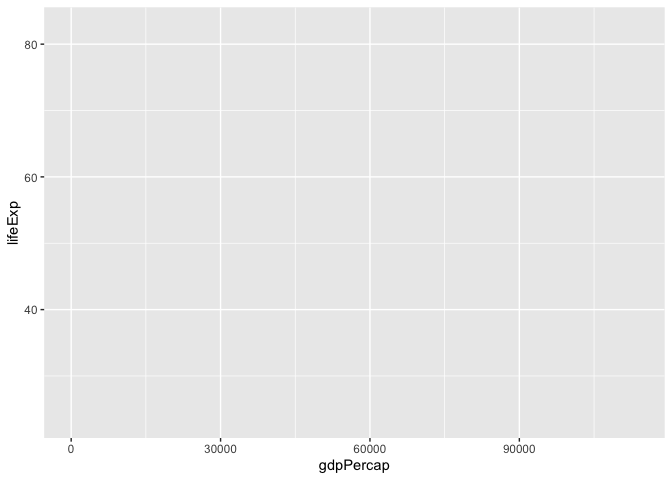
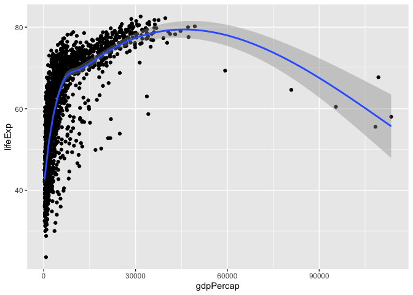
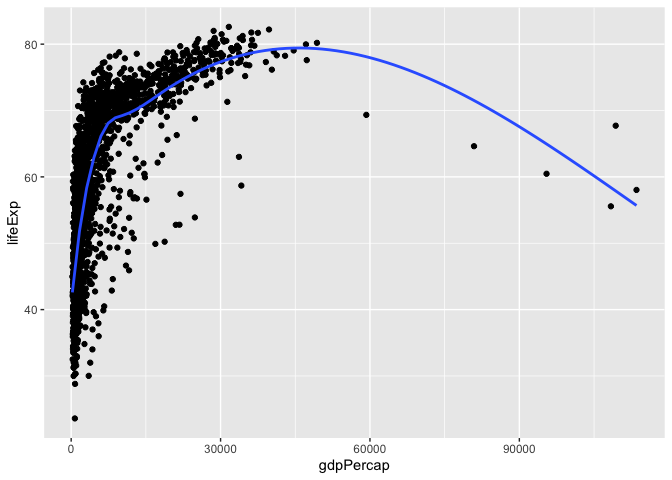
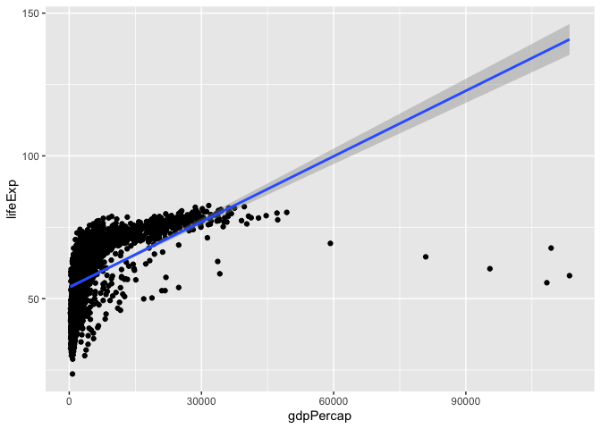
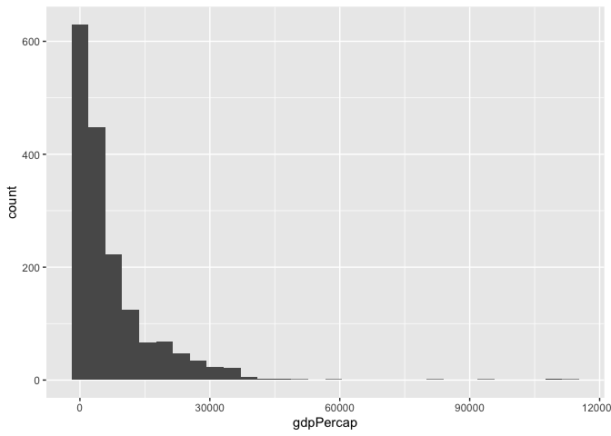

## Review of ggplot


```r
library(ggplot2)
library(gapminder)
names(gapminder)
```

```
## [1] "country"   "continent" "year"      "lifeExp"   "pop"       "gdpPercap"
```

```r
?ggplot
ggplot(data = gapminder, mapping=aes(x=gdpPercap, y=lifeExp))
```

<!-- -->

```r
ggplot(data = gapminder, mapping=aes(x=gdpPercap, y=lifeExp)) +
  geom_point()
```

<!-- -->

```r
ggplot(data = gapminder, mapping=aes(x=gdpPercap, y=lifeExp)) +
  geom_point()+
  geom_smooth()
```

<!-- -->

```r
ggplot(data = gapminder, mapping=aes(x=gdpPercap, y=lifeExp)) +
  geom_point()+
  geom_smooth(se=FALSE)
```

<!-- -->

```r
ggplot(data = gapminder, mapping=aes(x=gdpPercap, y=lifeExp)) +
  geom_point()+
  geom_smooth(method="lm")
```

<!-- -->

```r
ggplot(data = gapminder, mapping=aes(x=gdpPercap)) +
  geom_histogram()
```

<!-- -->

## Current Population Survey

Today you will investigate racial disparities in the labor market using data from the [Current Population Survey](https://www.census.gov/programs-surveys/cps.html) (CPS), a large survey administered by the [US Census Bureau](https://www.census.gov/en.html) and the [Bureau of Labor Statistics](https://www.bls.gov). The federal government uses the CPS to estimate the unemployment rate. Economists use the CPS to study a variety of topics in labor economics, including the effect of binding minimum wages, the gender pay gap, and returns to schooling. You will use a CPS sample of workers from Boston and Chicago to study employment patterns by race.

## Preliminaries

### Load packages

Use the `p_load` function to install and load the `tidyverse`.


```r
library(pacman)
p_load(tidyverse)
```

### Import data

The data file is `Lab3.csv`. 
Import the data using `read_csv`:


```r
cps <- read_csv("Lab3.csv")
```

By looking at the dataset, you can see that most of the variables are binary: they take values of either 1 or 0.


```r
cps
```

```
## # A tibble: 8,891 × 5
##    employed black female educ              exper
##       <dbl> <dbl>  <dbl> <chr>             <dbl>
##  1        1     0      1 HS Graduate          20
##  2        0     0      0 HS Graduate          20
##  3        1     1      1 HS Dropout           12
##  4        1     1      0 HS Dropout           17
##  5        0     1      1 HS Graduate          21
##  6        1     0      1 College or Higher    13
##  7        1     0      0 Some College         15
##  8        1     0      1 College or Higher     5
##  9        1     0      1 College or Higher     3
## 10        0     0      1 College or Higher     4
## # … with 8,881 more rows
```

For example, individuals with `employed == 1` have a job while those with `employed == 0` do not. 

## Employment Rates

**What percentage of individuals in the sample are employed?**

The mean of a binary variable gives the fraction of observations with values equal to 1.


```r
mean(cps$employed)
```

```
## [1] NA
```

Something went wrong. If you use the `summary` function, you'll see that there are missing values (`NA`s) of `employed`.


```r
summary(cps$employed)
```

```
##    Min. 1st Qu.  Median    Mean 3rd Qu.    Max.    NA's 
##  0.0000  1.0000  1.0000  0.7811  1.0000  1.0000      18
```

When there are missing values, some functions, like `mean`, will return a missing value as output. To circumvent this, you can specify `na.rm = TRUE` in the `mean` function:


```r
mean(cps$employed, na.rm = TRUE)
```

```
## [1] 0.7811338
```

The employment rate is 78 percent. 

**What are the employment rates by race and gender?**


```r
cps %>% 
  group_by(black, female) %>% 
  summarize(employed = mean(employed, na.rm = TRUE))
```

```
## # A tibble: 4 × 3
## # Groups:   black [2]
##   black female employed
##   <dbl>  <dbl>    <dbl>
## 1     0      0    0.868
## 2     0      1    0.723
## 3     1      0    0.718
## 4     1      1    0.693
```

You can see that the employment rate is 

- 87 percent for white males (`black == 0` and `female == 0`)
- 72 percent for white females (`black == 0` and `female == 1`)
- 72 percent for black males (`black == 1` and `female == 0`)
- 69 percent for black females (`black == 1` and `female == 1`).

### Racial disparities

**What is the average difference in employment status between black individuals and white individuals?**

To find the difference, 

1. Use the `filter` function to restrict the sample to one group (black or white)
2. Use `mean` to calculate the group mean
3. Repeat for the other group
4. Take the difference in means.


```r
black_emp <- filter(cps, black == 1)$employed %>% 
  mean(., na.rm = TRUE)
white_emp <- filter(cps, black == 0)$employed %>% 
  mean(., na.rm = TRUE)
black_emp - white_emp
```

```
## [1] -0.09128578
```

The employment rate is 9 percentage points lower for black individuals than for white individuals.

**Does this mean that there is racial disparity?**

Not yet. We still don't know if the difference is statistically significant. You can find out by conducting a $t$-test of the null hypothesis that the true difference-in-means is zero against the alternative hypothesis that the difference is nonzero.

To conduct the test, you need to calculate the $t$-statistic for the difference-in-means, which is given by

$$t = \dfrac{\overline{\text{Employed}}_\text{Black} - \overline{\text{Employed}}_\text{White}}{\sqrt{S^2_\text{Black}/n_\text{Black} + S^2_\text{White}/n_\text{White}}}.$$

You can calculate the quantities you need for the $t$-stat using `mean`, `var`, and `nrow`:


```r
# black mean
mean_b <- filter(cps, black == 1)$employed %>% 
  mean(., na.rm = TRUE)
# white mean
mean_w <- filter(cps, black == 0)$employed %>% 
  mean(., na.rm = TRUE)
# black variance
var_b <- filter(cps, black == 1)$employed %>% 
  var(., na.rm = TRUE)
# white variance
var_w <- filter(cps, black == 0)$employed %>% 
  var(., na.rm = TRUE)
# number of black observations 
# NOTE: !is.na(employed) removes the missing observations of employed
n_b <- filter(cps, black == 1 & !is.na(employed)) %>% 
  nrow()
# number of white observations
n_w <- filter(cps, black == 0 & !is.na(employed)) %>% 
  nrow()
# t-stat
t_stat <- (mean_b - mean_w) / sqrt(var_b/n_b + var_w/n_w)
t_stat
```

```
## [1] -6.844988
```

```r
n_b+n_w
```

```
## [1] 8873
```

```r
n_w
```

```
## [1] 7537
```

To conclude your test, compare your $t$-stat to 2 (an approximation for the critical value of $t$ in 5 percent test--we will do more rigorous hypothesis testing later in the course). If $|t| > 2$, then you can reject the null hypothesis. Your $t$-stat of -6.84 is certainly more extreme than 2, so you can reject the null hypothesis. This means that the difference in employment rates is statistically significant. There is a racial disparity in employment.

### Discrimination?

Does the disparity in employment rates provide causal evidence of racial discrimination in hiring? Does the comparison of employment rates by race hold all else constant? What else could explain the gap?

