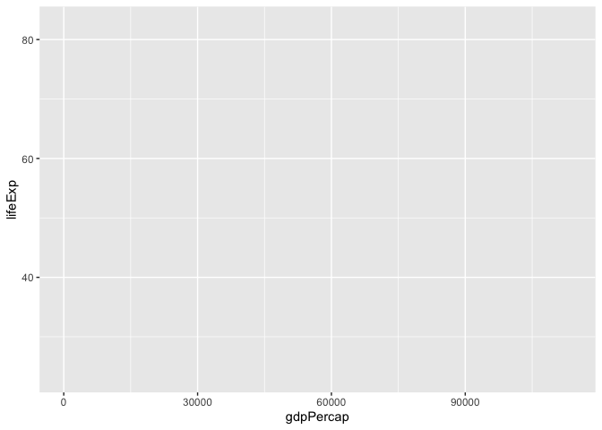
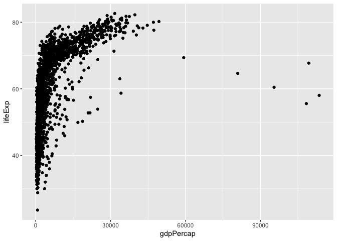
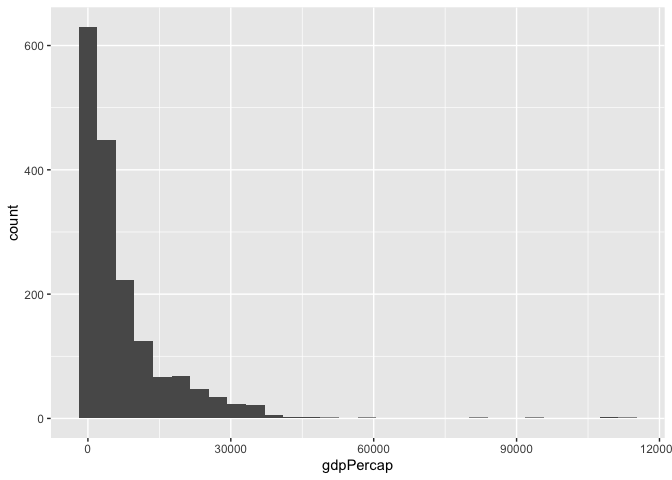

***
## 1. Review of R 
### Install and load the packages
- If it's your first time using the package, you are most likely to have not installed it. Then run `install.packages("<packageName>")`. ( Replace <packageName> with the actual name of the package, i.e. `install.packages("tidyverse")` )
- Installation and loading it is two separate thing, just like you need to click on the software to initialize it after installing it on your laptop, you need to run `library()` to load the package on your R studio. (i.e., `library('tidyverse')`)

### What are packages?

'R packages are collection of **functions** and **data sets** developed by the community' [Retrieved from here](https://www.datacamp.com/community/tutorials/r-packages-guide)

### What is a function? 

- Examples: print(), ggplot(), select(), filter(), etc.
- Let's create one!


```r
addition = function(param1, param2){
  result = param1+param2
  return(result)
}
# param1, param2 are referred to as input parameters of the addition function.
```


Side note: parameters of regression equation is $\beta_1$, $\beta_2$ in $Y
_i=\beta_1 + \beta_2 X_i + u_i$ (more on this on page 85 of the textbook)


```r
addition(param1=1,param2=2)
```

```
## [1] 3
```

```r
# 1 and 2 are referred to as the arguments of the function call.
subtraction = function(banana, apple){
  result = banana-apple
  return(result)
}
# By default, unless specified otherwise, banana=2, apple=3 because banana comes before apple in the order of parameters in the function.
subtraction(banana=2, apple=3)
```

```
## [1] -1
```

```r
subtraction(2,3)
```

```
## [1] -1
```

```r
# If we specify parameters with corresponding arguments, order doesn't matter.
subtraction(apple=2,banana=3)
```

```
## [1] 1
```

```r
print
```

```
## function (x, ...) 
## UseMethod("print")
## <bytecode: 0x7f80fef189c8>
## <environment: namespace:base>
```

```r
library(gapminder)
library(ggplot2)
geom_vline
```

```
## function (mapping = NULL, data = NULL, ..., xintercept, na.rm = FALSE, 
##     show.legend = NA) 
## {
##     if (!missing(xintercept)) {
##         if (!is.null(mapping)) {
##             warn_overwritten_args("geom_vline()", "mapping", 
##                 "xintercept")
##         }
##         if (!is.null(data)) {
##             warn_overwritten_args("geom_vline()", "data", "xintercept")
##         }
##         data <- new_data_frame(list(xintercept = xintercept))
##         mapping <- aes(xintercept = xintercept)
##         show.legend <- FALSE
##     }
##     layer(data = data, mapping = mapping, stat = StatIdentity, 
##         geom = GeomVline, position = PositionIdentity, show.legend = show.legend, 
##         inherit.aes = FALSE, params = list(na.rm = na.rm, ...))
## }
## <bytecode: 0x7f80f8089318>
## <environment: namespace:ggplot2>
```

```r
aes
```

```
## function (x, y, ...) 
## {
##     exprs <- enquos(x = x, y = y, ..., .ignore_empty = "all")
##     aes <- new_aes(exprs, env = parent.frame())
##     rename_aes(aes)
## }
## <bytecode: 0x7f80f80dca20>
## <environment: namespace:ggplot2>
```

```r
ggplot(gapminder, aes(x=gdpPercap, y=lifeExp)) + geom_point()
```

<!-- -->

```r
# Following code won't run.
# ggplot(aes(x=gdpPercap, y=lifeExp), gapminder) + geom_point()
ggplot(mapping=aes(x=gdpPercap, y=lifeExp), data = gapminder) + geom_point()
```

<!-- -->

***
## 2. Review of ggplot
 


```r
library(ggplot2)
ggplot(data = gapminder, mapping=aes(x=gdpPercap, y=lifeExp))
```

<!-- -->

```r
ggplot(data = gapminder, mapping=aes(x=gdpPercap, y=lifeExp)) +
  geom_point()
```

<!-- -->

```r
ggplot(data = gapminder, mapping=aes(x=gdpPercap, y=lifeExp)) +
  geom_point()+
  geom_smooth()
```

```
## `geom_smooth()` using method = 'gam' and formula 'y ~ s(x, bs = "cs")'
```

<!-- -->

```r
ggplot(data = gapminder, mapping=aes(x=gdpPercap, y=lifeExp)) +
  geom_point()+
  geom_smooth(se=FALSE)
```

```
## `geom_smooth()` using method = 'gam' and formula 'y ~ s(x, bs = "cs")'
```

<!-- -->

```r
ggplot(data = gapminder, mapping=aes(x=gdpPercap, y=lifeExp)) +
  geom_point()+
  geom_smooth(method="lm")
```

```
## `geom_smooth()` using formula 'y ~ x'
```

<!-- -->

```r
ggplot(data = gapminder, mapping=aes(x=gdpPercap)) +
  geom_histogram()
```

```
## `stat_bin()` using `bins = 30`. Pick better value with `binwidth`.
```

<!-- -->

```r
ggplot(data = gapminder, mapping=aes(x=gdpPercap)) +
  geom_density()
```

<!-- -->

```r
ggplot(data = gapminder, mapping=aes(x=gdpPercap, color=continent, fill=continent)) +
  geom_density(alpha=0.3)
```

<!-- -->

```r
ggplot(data = gapminder, mapping=aes(y=lifeExp, 
                                     x=gdpPercap, 
                                     color=continent)) + 
  geom_point()
```

<!-- -->

```r
ggplot(data = gapminder, mapping=aes(y=lifeExp, 
                                     x=gdpPercap, 
                                     color=continent, 
                                     shape=continent)) + 
  geom_point()
```

<!-- -->

```r
ggplot(data = gapminder, mapping=aes(y=lifeExp, 
                                     x=gdpPercap, 
                                     color=continent, 
                                     shape=continent)) + 
  geom_point()+
  geom_smooth()
```

```
## `geom_smooth()` using method = 'loess' and formula 'y ~ x'
```

<!-- -->

***
## 3. Import data externally

### Load tidyverse


```r
library(tidyverse)
```

```
## ── Attaching packages ─────────────────────────────────────── tidyverse 1.3.1 ──
```

```
## ✓ tibble  3.1.4     ✓ dplyr   1.0.7
## ✓ tidyr   1.1.3     ✓ stringr 1.4.0
## ✓ readr   1.4.0     ✓ forcats 0.5.1
## ✓ purrr   0.3.4
```

```
## ── Conflicts ────────────────────────────────────────── tidyverse_conflicts() ──
## x dplyr::filter() masks stats::filter()
## x dplyr::lag()    masks stats::lag()
```

### read_csv() function in tidyverse package

- R will look for the file called 'lab2.csv'
- But where is the lab2.csv? 
- We need to specify the location of this file, such that R knows where to look for the file.


```r
# Below code won't run because R doesn't know which folder to look at for lab2.csv.
# our_data <- read_csv("lab2.csv") 
# could do this if you set working directory to the folder that lab2.csv is in OR
cps <- read_csv('/Users/boyoonc/ec320_labs/lab3/lab3.csv')
```

```
## 
## ── Column specification ────────────────────────────────────────────────────────
## cols(
##   employed = col_double(),
##   black = col_double(),
##   female = col_double(),
##   educ = col_character(),
##   exper = col_double()
## )
```

***
## 4. Data analysis

### Get a grasp about the data structure
- View(): open another tab that shows the data
- glimpse(): returns number of rows and columns as well as some observations
- dim(): returns the dimension of the data
- summary(): summary about each variable
- names(): names of the variables

### Pipe operator


```r
?summarize()
?group_by()
cps %>% 
  group_by(black, female) %>% 
  summarize(employed = mean(employed, na.rm = TRUE))
```

```
## `summarise()` has grouped output by 'black'. You can override using the `.groups` argument.
```

```
## # A tibble: 4 × 3
## # Groups:   black [2]
##   black female employed
##   <dbl>  <dbl>    <dbl>
## 1     0      0    0.868
## 2     0      1    0.723
## 3     1      0    0.718
## 4     1      1    0.693
```

```r
# Equivalently,
summarize(group_by(cps, black, female),
          employed = mean(employed, na.rm = TRUE))
```

```
## `summarise()` has grouped output by 'black'. You can override using the `.groups` argument.
```

```
## # A tibble: 4 × 3
## # Groups:   black [2]
##   black female employed
##   <dbl>  <dbl>    <dbl>
## 1     0      0    0.868
## 2     0      1    0.723
## 3     1      0    0.718
## 4     1      1    0.693
```

### Dummy variable


```r
table(cps$employed)
```

```
## 
##    0    1 
## 1942 6931
```

```r
c(sample(c(0,1), 10, prob=c(0.5,0.5), replace=TRUE)) %>%
  print() %>%
  mean()
```

```
##  [1] 0 1 0 1 1 0 1 1 0 0
```

```
## [1] 0.5
```

```r
# The fraction of 1s in the entire observations, or in the sample
# The percentage of individuals in the sample who denoted as 1s.
mean(cps$employed, na.rm = TRUE)
```

```
## [1] 0.7811338
```

```r
cps %>% group_by(black) %>% summarize(mean(employed, na.rm=TRUE)) %>% 
  c(diff=.[[2,2]]-.[[1,2]]) 
```

```
## $black
## [1] 0 1
## 
## $`mean(employed, na.rm = TRUE)`
## [1] 0.7948786 0.7035928
## 
## $diff
## [1] -0.09128578
```

### t-stat


```r
ggplot()+
  stat_function(fun=dt, args=list(df=8871), geom="line")+
  stat_function(fun=dt, args=list(df=8871), geom="area", fill="red", xlim=c(-5,-2)) +
  stat_function(fun=dt, args=list(df=8871), geom="area", fill="red", xlim=c(2,5)) +
  xlim(-10,10)+
  geom_vline(xintercept=-6.8, color="blue")+
  annotate("text", x= -6.8, y=-0.01,label="x=-6.8", color="blue")
```

<!-- -->

