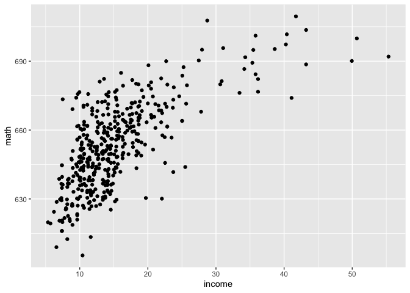
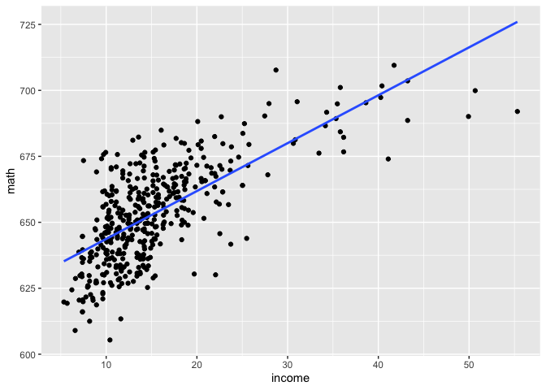

## Setup

```r
library(pacman)
p_load(tidyverse, broom, stargazer, AER)
# Note: broom package contains the tidy() function
# AER is just loaded to get the CASchools data
```

## Data
For this lab, we will use data from the `AER` package on California schools. To get this data and use it we can: 

```r
data("CASchools")
# note, remind them  that they need to use read_csv() for the problem set

# look at a  snapshot
head(CASchools, 10)
```

```
##    district                          school      county grades students
## 1     75119              Sunol Glen Unified     Alameda  KK-08      195
## 2     61499            Manzanita Elementary       Butte  KK-08      240
## 3     61549     Thermalito Union Elementary       Butte  KK-08     1550
## 4     61457 Golden Feather Union Elementary       Butte  KK-08      243
## 5     61523        Palermo Union Elementary       Butte  KK-08     1335
## 6     62042         Burrel Union Elementary      Fresno  KK-08      137
## 7     68536           Holt Union Elementary San Joaquin  KK-08      195
## 8     63834             Vineland Elementary        Kern  KK-08      888
## 9     62331        Orange Center Elementary      Fresno  KK-08      379
## 10    67306     Del Paso Heights Elementary  Sacramento  KK-06     2247
##    teachers calworks    lunch computer expenditure    income   english  read
## 1     10.90   0.5102   2.0408       67    6384.911 22.690001  0.000000 691.6
## 2     11.15  15.4167  47.9167      101    5099.381  9.824000  4.583333 660.5
## 3     82.90  55.0323  76.3226      169    5501.955  8.978000 30.000002 636.3
## 4     14.00  36.4754  77.0492       85    7101.831  8.978000  0.000000 651.9
## 5     71.50  33.1086  78.4270      171    5235.988  9.080333 13.857677 641.8
## 6      6.40  12.3188  86.9565       25    5580.147 10.415000 12.408759 605.7
## 7     10.00  12.9032  94.6237       28    5253.331  6.577000 68.717949 604.5
## 8     42.50  18.8063 100.0000       66    4565.746  8.174000 46.959461 605.5
## 9     19.00  32.1900  93.1398       35    5355.548  7.385000 30.079157 608.9
## 10   108.00  78.9942  87.3164        0    5036.211 11.613333 40.275921 611.9
##     math
## 1  690.0
## 2  661.9
## 3  650.9
## 4  643.5
## 5  639.9
## 6  605.4
## 7  609.0
## 8  612.5
## 9  616.1
## 10 613.4
```

```r
names(CASchools)
```

```
##  [1] "district"    "school"      "county"      "grades"      "students"   
##  [6] "teachers"    "calworks"    "lunch"       "computer"    "expenditure"
## [11] "income"      "english"     "read"        "math"
```

## Simple OLS Regression
### Running a regression
To do a regression in R, we use `lm()`. The basic steup: name <- lm(y ~ x, data = name_of_df). 

Let's regress reading scores on student expenditure.

```r
lm(read ~ expenditure, data = CASchools)
```

```
## 
## Call:
## lm(formula = read ~ expenditure, data = CASchools)
## 
## Coefficients:
## (Intercept)  expenditure  
##   6.182e+02    6.912e-03
```

The output from `lm()` gives us an intercept coefficient, $\hat{\beta}_0$, and a slope coefficient, $\hat{\beta}_1$. 

Let's run another regression. Regress math schores on student expenditure.

```r
lm(read ~ expenditure, data = CASchools)
```

```
## 
## Call:
## lm(formula = read ~ expenditure, data = CASchools)
## 
## Coefficients:
## (Intercept)  expenditure  
##   6.182e+02    6.912e-03
```

On your own, try to code a regression for $Math_i = \beta_0 + \beta_1 Income_i  + u_i$.


```r
lm(math ~ income,  data = CASchools)
```

```
## 
## Call:
## lm(formula = math ~ income, data = CASchools)
## 
## Coefficients:
## (Intercept)       income  
##     625.539        1.815
```

### Making tables
Now that we know how to run a regression, let's talk about how to look at  the output. The output above wasn't super informative...

#### Using `summary()`
The first option is to use the summary function in R. There are two ways to do this:

1: Nest the `lm()` inside `summary()`

```r
summary(lm(math ~ income, data = CASchools))
```

```
## 
## Call:
## lm(formula = math ~ income, data = CASchools)
## 
## Residuals:
##     Min      1Q  Median      3Q     Max 
## -39.045  -8.997   0.308   8.416  34.246 
## 
## Coefficients:
##              Estimate Std. Error t value Pr(>|t|)    
## (Intercept) 625.53948    1.53627  407.18   <2e-16 ***
## income        1.81523    0.09073   20.01   <2e-16 ***
## ---
## Signif. codes:  0 '***' 0.001 '**' 0.01 '*' 0.05 '.' 0.1 ' ' 1
## 
## Residual standard error: 13.42 on 418 degrees of freedom
## Multiple R-squared:  0.4892,	Adjusted R-squared:  0.4879 
## F-statistic: 400.3 on 1 and 418 DF,  p-value: < 2.2e-16
```

2: Save your regression as an object in R so that we can then use that object later! (This is preferred).

```r
reg1 <- lm(math ~ income, data = CASchools)
summary(reg1)
```

```
## 
## Call:
## lm(formula = math ~ income, data = CASchools)
## 
## Residuals:
##     Min      1Q  Median      3Q     Max 
## -39.045  -8.997   0.308   8.416  34.246 
## 
## Coefficients:
##              Estimate Std. Error t value Pr(>|t|)    
## (Intercept) 625.53948    1.53627  407.18   <2e-16 ***
## income        1.81523    0.09073   20.01   <2e-16 ***
## ---
## Signif. codes:  0 '***' 0.001 '**' 0.01 '*' 0.05 '.' 0.1 ' ' 1
## 
## Residual standard error: 13.42 on 418 degrees of freedom
## Multiple R-squared:  0.4892,	Adjusted R-squared:  0.4879 
## F-statistic: 400.3 on 1 and 418 DF,  p-value: < 2.2e-16
```
Notice that both ways produce the same output. We have the intercept coefficient, $\hat{\beta}_0 = 625$, and the  slope coefficient $\hat{\beta}_1 = 1.8$. `summary()` also gives us other information that we didn't  have before like the standard error, the t-score, the p-value, and  the $R^2$. The stars on the p-value tell us if the coefficient is statistically significant (more on this after the midterm).

#### Using `tidy()`
Another way to make nice regression output is to use the `tidy()` function from the `broom` package. To use this, you must have loaded the `broom` package in  `p_load()`. The process is similar:

```r
# since we have already created reg1 as an object, we can just call it without having to redo the regression
tidy(reg1)
```

```
## # A tibble: 2 × 5
##   term        estimate std.error statistic  p.value
##   <chr>          <dbl>     <dbl>     <dbl>    <dbl>
## 1 (Intercept)   626.      1.54       407.  0       
## 2 income          1.82    0.0907      20.0 5.99e-63
```
`tidy()` puts the information from `summary()` into a much nicer looking table. 

#### Stargazer
By far, the most powerful tool for making amazing tables in R is the `stargazer` package. I  would encourage you to try this out if you are feeling up for it! 

First, let's try to make a simple table with `stargazer()` using our `reg1` object.

```r
stargazer(reg1)
```

```
## 
## % Table created by stargazer v.5.2.2 by Marek Hlavac, Harvard University. E-mail: hlavac at fas.harvard.edu
## % Date and time: Fri, Oct 22, 2021 - 12:21:00
## \begin{table}[!htbp] \centering 
##   \caption{} 
##   \label{} 
## \begin{tabular}{@{\extracolsep{5pt}}lc} 
## \\[-1.8ex]\hline 
## \hline \\[-1.8ex] 
##  & \multicolumn{1}{c}{\textit{Dependent variable:}} \\ 
## \cline{2-2} 
## \\[-1.8ex] & math \\ 
## \hline \\[-1.8ex] 
##  income & 1.815$^{***}$ \\ 
##   & (0.091) \\ 
##   & \\ 
##  Constant & 625.539$^{***}$ \\ 
##   & (1.536) \\ 
##   & \\ 
## \hline \\[-1.8ex] 
## Observations & 420 \\ 
## R$^{2}$ & 0.489 \\ 
## Adjusted R$^{2}$ & 0.488 \\ 
## Residual Std. Error & 13.420 (df = 418) \\ 
## F Statistic & 400.257$^{***}$ (df = 1; 418) \\ 
## \hline 
## \hline \\[-1.8ex] 
## \textit{Note:}  & \multicolumn{1}{r}{$^{*}$p$<$0.1; $^{**}$p$<$0.05; $^{***}$p$<$0.01} \\ 
## \end{tabular} 
## \end{table}
```
Huh, weird output right? Stargazer is defaulting to TeX output. We can change the type of output we want.

1: As text (use this for your problem set)

```r
stargazer(reg1, type = "text")
```

```
## 
## ===============================================
##                         Dependent variable:    
##                     ---------------------------
##                                math            
## -----------------------------------------------
## income                       1.815***          
##                               (0.091)          
##                                                
## Constant                    625.539***         
##                               (1.536)          
##                                                
## -----------------------------------------------
## Observations                    420            
## R2                             0.489           
## Adjusted R2                    0.488           
## Residual Std. Error      13.420 (df = 418)     
## F Statistic          400.257*** (df = 1; 418)  
## ===============================================
## Note:               *p<0.1; **p<0.05; ***p<0.01
```
Stargazer can also do html output and MS word output (although word output  is not recommended).

Stargazer gave us some stats that we  don't really care about... let's get rid of them...

```r
stargazer(reg1, keep.stat =c("rsq", "n"), type = "text")
```

```
## 
## ========================================
##                  Dependent variable:    
##              ---------------------------
##                         math            
## ----------------------------------------
## income                1.815***          
##                        (0.091)          
##                                         
## Constant             625.539***         
##                        (1.536)          
##                                         
## ----------------------------------------
## Observations             420            
## R2                      0.489           
## ========================================
## Note:        *p<0.1; **p<0.05; ***p<0.01
```

Looks great!

Unlike the tables we made using `summary()` and `broom()`, stargazer can combine multiple regressions into one table!

```r
# do another regression and save it as an object
reg2 <- lm(read ~ income, data = CASchools)
stargazer(reg1, reg2, keep.stat =c("rsq", "n"), type = "text")
```

```
## 
## =========================================
##                  Dependent variable:     
##              ----------------------------
##                   math          read     
##                   (1)            (2)     
## -----------------------------------------
## income          1.815***      1.942***   
##                 (0.091)        (0.097)   
##                                          
## Constant       625.539***    625.228***  
##                 (1.536)        (1.651)   
##                                          
## -----------------------------------------
## Observations      420            420     
## R2               0.489          0.487    
## =========================================
## Note:         *p<0.1; **p<0.05; ***p<0.01
```

The variables in the regressions don't even have to be the same!

```r
# do another regression and save it as an object
reg3 <- lm(read ~ expenditure, data = CASchools)
stargazer(reg1, reg2, reg3, keep.stat =c("rsq", "n"), type = "text")
```

```
## 
## =============================================
##                    Dependent variable:       
##              --------------------------------
##                 math            read         
##                 (1)        (2)        (3)    
## ---------------------------------------------
## income        1.815***   1.942***            
##               (0.091)    (0.097)             
##                                              
## expenditure                         0.007*** 
##                                     (0.002)  
##                                              
## Constant     625.539*** 625.228*** 618.249***
##               (1.536)    (1.651)    (8.101)  
##                                              
## ---------------------------------------------
## Observations    420        420        420    
## R2             0.489      0.487      0.047   
## =============================================
## Note:             *p<0.1; **p<0.05; ***p<0.01
```
We can get really fancy with `stargazer()`. For more info, see the cheatsheet on Canvas.

### Visualizing your regression
Lastly, we can use ggplot and fit a regression line through our data. Let's start by making a scatterplot with math scores on the y axis and income on the x axis.


```r
ggplot(data = CASchools, aes(x = income, y = math)) + geom_point()
```

<!-- -->

To add a regression line, we use the `stat_smooth()` function:

```r
# method = "lm" tells R that we are using OLS. se = FALSE removes the standard error bars.
ggplot(data = CASchools, aes(x = income, y = math)) + geom_point() + stat_smooth(method ="lm", se =FALSE)
```

```
## `geom_smooth()` using formula 'y ~ x'
```

<!-- -->
